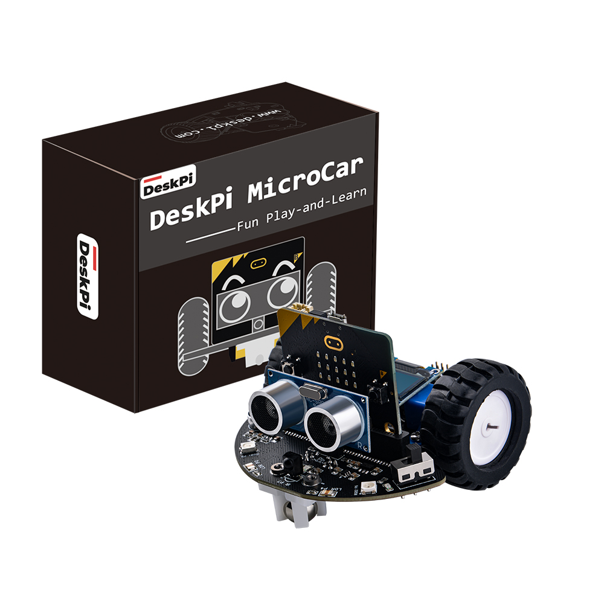

# DeskPi MicroCar 

##　Revision History
* Date	Version	Description
* July 4, 2023	V1.0	Initial release
		
##　Introduction
DeskPi MicroCar is a multi-functional and multi-purpose intelligent cart, Based on microbit. 
it has on-board motors, ultrasonic, and other sensors, programmed and controlled by Makecode, adoption of graphical programming language. This car especially suitable for students with zero or weak programming fundamentals. This car contains the introduction of the use of independent modules on the trolley and the introduction of comprehensive application cases, first learn the basics, and then comprehensive application, step by step, to enhance the students' hands-on and programming capabilities.

## Key Features
* Designed for Microbit
* All modules are pre-wired
* 9 types easy-to-use modules
* 4 WS2812 RGB leds
* 0.96’’ 128x64 OLED Display
* Volume detection
* 2 Optical sensors
* 2 Programmable keys
* 2 Grayscale sensors
* Ultrasonic
* IR receiver
* 2 Motors
* Powered by 3 x #7 1.5V batteries, separate power control switch
* 2 servo expansion ports
* with 4 x M3 structural extension threaded holes

## What’s Included
* 1 x Micro:bit
* 1 x DeskPi MicroCar
* 1 x OLED Desplay
* 1 x Utrasonic Sensor
* 1 x Remote Control
* 1 x Gimbal
* 2 x Wheels
* 2 x Motor Mounting Brackets
* 10 x M3*5 Bolts
* 1 x Micro USB Cable
